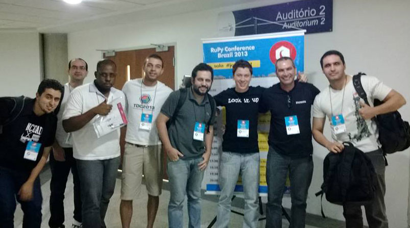

No dia 29/11/13, em São José dos Campos (SP), ocorreu a edição de 2013 do RuPy Conference Brazil e estive lá marcando presença. Este ano teve 3 trilhas: Ruby, Python e JavaScript.

Vou resumir algumas palestras que achei interessante. Não dava para assistir todas, porque as trilhas corriam em paralelo, mas consegui assistir ótimas palestras.

<!--truncate-->

Na foto estou com uma segunda mochila na mão, e dentro dela um fone de ouvido, que ganhei por ser o primeiro a participar com uma pergunta na Mesa Redonda. 😁

## Node.js: serious business
por **Pedro Franceschi**

Pedro Franceschi, CEO da startup Pagar.Me, compartilhou a experiência em utilizar o Node.js como back-end para lidar com as transações financeiras do seu serviço. Mostrou tanto o lado positivo, como seu próprio case de sucesso, quanto o lado negativo, que foram as dificuldades que ele teve durante o processo de implementação.

É interessante ver uma startup utilizando o Node.js, pois ele ainda está na versão beta (v0.10). O Node.js promete ser uma ferramenta poderosa para lidar com requisições concorrentes, sua estrutura é baseada em um modelo não obtrusivo de I/O, baseado em evento, e utiliza uma linguagem que está em ascensão: JavaScript. Eu acredito que o Node.js tem um grande futuro, pois sua proposta vem atender uma demanda alta, então ainda ouviremos muito sobre ele.

Link para apresentação: http://www.slideshare.net/PedroFranceschi/palestra-nodejs

Vídeo da Palestra: http://youtu.be/_0opytdAXHk

## Construindo aplicações com Zero LoadTime
por **João M. D. Moura**

Apesar de rápida, foi uma apresentação excelente. João Moura demonstra a importância de um site ter um carregamento rápido, e o impacto que isso causa no negócio, demonstrando alguns cases.

Como solução, ele levanta uma questão muito interessante que é a velocidade percebida, e dá exemplos de aplicações onde o upload da informação é feito em background, e aplicações que já presume a ação do usuário para adiantar um processo de upload, também em background.

A usabilidade é um assunto que vejo cada vez mais presente nos eventos, e este assunto levanta questões muito importantes para modelar um negócio online.

Twitter do palestrante: https://twitter.com/joaomdmoura

Vídeo da Palestra: http://youtu.be/y1o_oGWI66k

## Segurança no Rails
por **Nando Vieira**

Apesar do foco no Rails, a apresentação foi bem ampla e aplicável para qualquer web back-end framework. Nando Vieira levantou questões importante de segurança, que apesar do framework facilitar muito a vida do programador neste quesito, falhas de programação pode comprometer toda aplicação e até mesmo o servidor.

Uma questão importante também levantada foi ter um SysAdmin responsável para configuração do servidor, para evitar que um profissional  inexperiente deixe alguma falha de segurança.  Sabemos muito bem que nem sempre é assim, que muitos programadores sem conhecimento em servidor quebra o galho só para evitar custos, mas não será que o barato mais um vez não sai caro? O palestrante demonstrou como é possível invadir um servidor mal configurado, e uma vez dentro do servidor, todo estrago é pouco.

Atualmente eu trabalho com segurança, então é uma questão que já me acostumei a pensar antes de qualquer coisa, mas acredito que é uma questão que vale ser fortemente considerada por qualquer profissional da área de TI em qualquer área do desenvolvimento e manutenção de um produto, pois as consequências podem ser maiores do que você pode imaginar.

Site do palestrante: http://nandovieira.com/

Vídeo da Palestra: http://youtu.be/GPglTMw-2Hw

## Lifestyle Business e o Ecossistema Python
por **Henrique Bastos**

Nada lembro do Ecossistema Python, mas não me sai da cabeça tudo que o Henrique Bastos falou sobre o Lifestyle Business. Mais do que uma discussão sobre carreira e negócios, Lifestyle Business é um estilo de carreira que visa a qualidade não só da carreira, mas também da qualidade de vida. Ele contou um pouco sobre sua carreira, os sucessos e dificuldades de um negócio próprio com funcionários, como isso o levou a decisão de trabalhar como freelancer, entre outras histórias. Eu não vou conseguir colocar toda a essência da apresentação em palavras, pois muitos pensamentos meus e das pessoas que estavam presente se misturaram, várias pessoas participaram com depoimentos e perguntas, que tornou o clima bem agradável, além do ótimo bom humor do palestrante.

Esse assunto acabou se estendendo para a Mesa Redonda, até mesmo por minha causa, que puxei esse assunto com a pergunta que iniciou a discussão, e outras perguntas acabaram seguindo o ritmo. Foi até bom, que os outros palestrantes puderam demonstrar também seus pontos de vista sobre carreira, empresa, clientes e negócios em geral.

Independente se você é da área de TI, vale a pena você procurar saber mais sobre o Lifestyle Business e como o mercado de trabalho é bem amplo e pode acolher todas as necessidades.

Site do palestrante: http://henriquebastos.net/

Vídeo da Palestra: http://youtu.be/mHRinieklio

## Tendências de hoje e amanhã no mundo ruby
por **Fabio Akita**

Fechando com chave de ouro, Fabio Akita faz o keynote final do evento falando sobre a história do ruby, que este ano completa 10 anos. Ele fala um pouco sobre a Cauda Longa, como a limitação gera inovação, como é importante uma comunidade não se granular, entre outros assuntos sobre a evolução da tecnologia.

O interessante foi a demonstração de ferramentas que atendem a necessidade de quem está começando agora, e precisa de ferramentas e serviços simples para um novo negócio.

Link para apresentação: http://www.slideshare.net/akitaonrails/rupy-2013-hoje-e-amanh-ruby-rails

Vídeo da Palestra: http://youtu.be/G_BvPRpnJOI

## Conclusão

Apesar de gostar das três linguagens, eu não acho interessante dividir o evento por linguagem, porque você acaba limitando muito o tema das palestras, ou deixando as pessoas perdidas. As palestras que citei aqui são um exemplo disto, com a exceção da que fala do Node.js, pois são assuntos mais amplos e que não se limita a uma determinada tecnologia. Ou então, se for mesmo para ser uma palestra mais técnica, que focassem os temas em assuntos específicos de cada tecnologia.

Em geral gostei do evento, consegui absorver bastante informação nova, além de ter um dia agradável com amigos da área. Ficamos sabendo que o evento já mudou de nome e que novidades estão por vir, agora nos resta aguardar para conferir.
