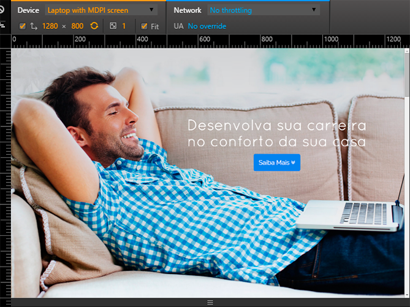
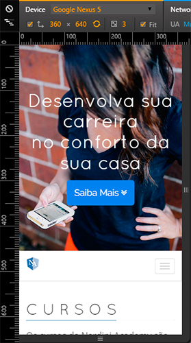
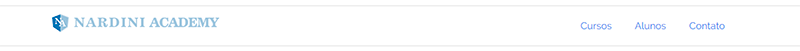
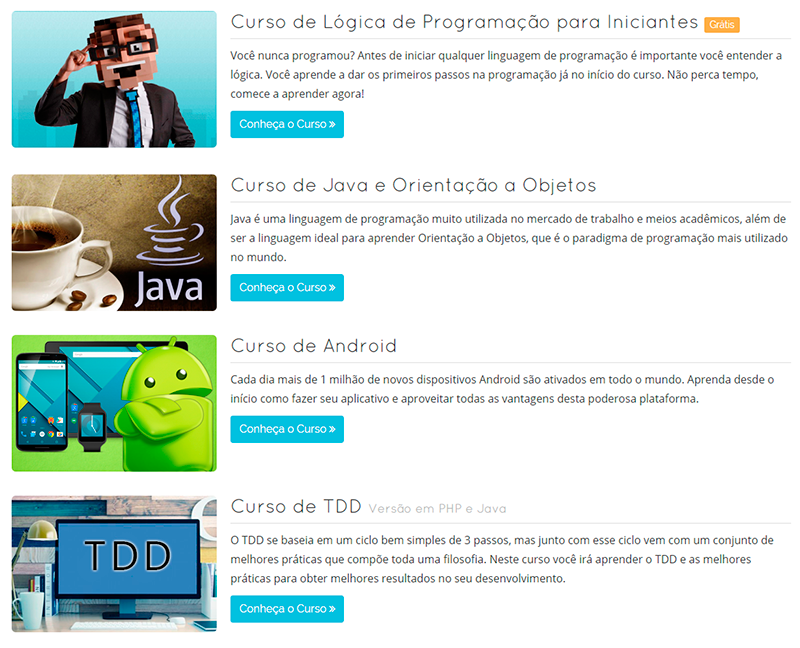

Depois de muitas semanas remodelando o novo site, ficou pronto!

Veja como ficou o resultado:

<!--truncate-->

## The Fold

Também conhecido como “janela visível do browser”, esta é a primeira parte do site que o usuário vê sem fazer a rolagem. Desta vez resolvi deixar bem mais limpo, somente com um título e uma chamada para ação. Veja o resultado:

<table>
    <tr>
        <td>
            
        </td>
        <td>
            
        </td>
    </tr>
</table>

Existe um estudo que imagens grandes tem uma melhor conversão, então segui a tendência e tentei usar uma imagem e um título que representasse bem a filosofia do NA, que é a comodidade de acessar um conteúdo profissional de qualidade em qualquer lugar.

A chamada para ação irá levar o usuário a conhecer o resto do site.

## Menu

O menu vem logo abaixo da imagem do fold, mas que se fixa no topo assim que ele chega lá. Vi muito esse efeito em novos layouts e gostei muito do resultado que ficou. Tentei deixar o mais limpo e simples possível, somente com a marca e os principais itens do site:

A forma que o menu se encaixa com o resto do layout é bem fluída, ela vai acompanhando o scroll do site. Nas páginas secundárias cumpre o papel de retornar para cada item da página inicial.

## Cursos

Mudei as imagens e a listagem dos cursos. Retirei as bordas e deixei as imagens com cantos arredondados, como cartões, deixou mais limpo e natural a listagem.

Apesar de eu ter gostado do resultado, futuramente vou condensar a listagem para não ficar muito grande com os novos cursos.

## Caixas

Mantive a primeira caixa com citação do Albert Einsten, pois é uma representação bem forte da filosofia do conteúdo do NA. A segunda caixa eu deixei com a missão, que é a definição clara de nosso objetivo.

## Alunos

Antes os depoimentos dos alunos estava em formato de caixa e com carrossel, mudei para realçar mais o conteúdo do texto, focando mais no próprio depoimento.

Para mim, o depoimento é a parte mais importante, pois ele representa o resultado do tempo que dedicamos em nossos cursos, e esse resultado é a satisfação dos alunos, o reconhecimento de um bom trabalho.

## Tipografia

Sempre tento buscar a melhor forma de comunicar o conteúdo dos cursos através dos textos e imagens, então tenho me preocupado muito com a tipografia de todo conteúdo gerado, desde o site até as apresentações do curso ou palestras. Entre testes e os feedbacks dos alunos, a evolução vem acontecendo progressivamente.

## Faça-nos uma visita!

Agora que você soube um pouco do trabalho que fiz, nada melhor do que conhecer o resultado:

    <a href="https://www.nardiniacademy.com" target="_blank">www.nardiniacademy.com</a>

