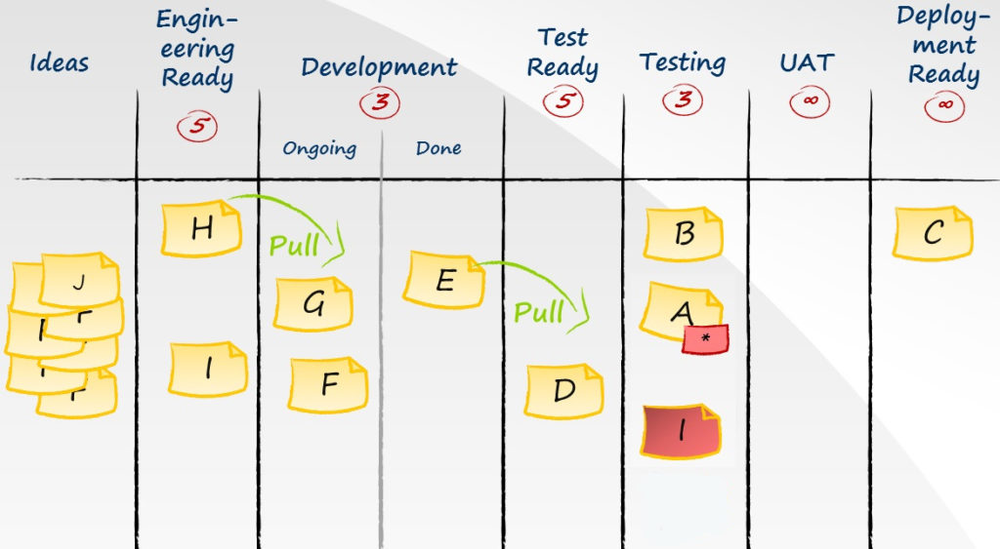

As reuniões diárias, conhecidas no XP como “Reuniões em Pé” (Stand Up Mettings) e no Scrum como “Scrum Diário” (Daily Scrum) são práticas bem simples e comumente adotadas, mas o que mais presenciei nas empresas foram monólogos entediantes feitos por um grupo de pessoas, sem valor nenhum, apenas mais um ritual burocrático sem sentido. Neste artigo vou dar sugestões de como trazer os benefícios prometidos, deixando o Daily mais produtivo.

<!--truncate-->

## O problema

No Scrum, o Daily requer que cada membro do time responda essas três perguntas:

- O que eu fiz desde a última reunião?
- O que eu pretendo fazer até a próxima reunião?
- Quais obstáculos ou impedimentos estão em meu caminho, impedindo a realização do trabalho?

Essas perguntas parecem fazer sentido e atender seu objetivo, que é ter uma atualização diária de como está o sprint para que todos possam saber se está tudo bem ou se alguém, principalmente o Scrum Master, precisa tomar alguma ação. Só que **se o objetivo é controlar o sprint, por que as perguntas são para controlar os membros do time?**

## A solução

Se o objetivo é acompanhar o sprint, nada mais justo que o daily ser focado nas tarefas, e não no time. Sendo assim, minha sugestão é reunir o time em frente ao Quadro de Tarefas (onde é controlado o progresso das tarefas) e ir perguntando ao time o progresso das tarefas que estão em desenvolvimento.

Imagem 1. *Quadro com as User Stories, pode ser real como um quadro branco com post it, ou virtual como Trello ou JIRA.*

Usando o quadro da Imagem 1 como exemplo, o Daily começa da última até a primeira coluna. Então no exemplo começaria pela coluna Deployment Ready, se a tarefa C foi entregue durante o período, fala-se sobre ela, em seguida vai para a coluna UAT, que não tem cartão, então segue para Testing e assim por diante. Uma outra abordagem é começar pelas tarefas de hotfix (correção de bug, tarefa I), depois a tarefa com impendimento (tarefa A) e depois seguir o fluxo das outras.

Se o time estiver bem alinhado no dia a dia, não precisa passar tarefa a tarefa, coluna a coluna, o importante é identificar possíveis impedimentos e verificar se o sprint vai ser entregue com sucesso.

Pode parecer que dessa forma é semelhante a cada um responder as 3 perguntas, mas dessa forma traz o seguintes benefícios:

- Tem o fator psicológico do time, todos passam a se preocupar mais com a entrega do sprint do que com os indivíduos.
  
- Fica mais fácil de manter o quadro atualizado, pois todos vão ter que atualizar o quadro antes do Daily ou ele pode ser atualizado durante.

- Evita constrangimentos ou cobranças desnecessárias. Se alguém do time se ausentou por motivos pessoais, mas o sprint está indo bem, não há questionamentos desnecessários sobre o dia dessa pessoa.

- O time fica mais unido, pois todos podem falar sobre todas as tarefas, não só da tarefa em que ele está responsável, deixando o time mais comprometido com o todo.

- Um dos principais motivos do quadro é visualização, então esse reforço visual ajuda a identificar possíveis gargalos e atrasos, mais do que ficar só ouvindo cada um.

Um sprint seguindo dessa forma já é possível notar os benefícios citados acima.

## Quem participa?

Os únicos obrigados a participar do daily são os desenvolvedores, ou seja, as pessoas responsáveis por executar as tarefas do sprint, pois são eles os responsáveis por entregar no final do sprint o que eles mesmo acordaram a entregar no Planning. Caso um ou outro não puderem participar no dia, o Daily deve acontecer do mesmo jeito, religiosamente.

O Scrum Master deve participar de todos também, pois ele é quem vai tomar uma ação para resolver os impedimentos do time. A maioria das empresas não dão importância para esse papel, ou acabam misturando o papel de SM com cargos e outros papeis, então se seu time não leva o Scrum a sério, a participação dele deve ser analisada para verificar se sua presença é positiva ou não. O Scrum Master não gerencia as tarefas, o próprio time de desenvolvedores é responsável por se auto-organizar, então ele se pronuncia somente se as práticas ágeis não estiverem sendo seguidas ou se for para resolver um impedimento.

O Product Owner não precisa participar, mas ele pode ficar disponível para caso o time precise tirar alguma dúvida sobre as tarefas. Particularmente, eu prefiro que as dúvidas das tarefas sejam feitas no dia a dia quando surgir a necessidade, somente com quem estiver envolvido com a tarefa em questão, assim não prejudica o Daily e não desperdiça o tempo do PO.

O cliente, ou qualquer pessoa que vá receber a entrega do sprint, não deve participar, pois deve ser respeitado o timebox do sprint, o Review é o único momento que ele deve estar presente.

Cada projeto/sprint tem seu próprio Daily somente com seu time, não junte times para fazer um Daily só, nem todo mundo precisa saber sobre tudo. O Daily focado no Quadro de Tarefas ajuda a organizar isso, se tem alguém que não influência na execução das tarefas do quadro não deveria estar presente.

Caso haja cobranças externa ao time de desenvolvimento durante o sprint, talvez o Scrum não seja o ideal para o seu projeto, talvez uma gestão sem timebox seja mais interessante, como o Kanban.

## Duração do Daily

O convencional é que o Daily não dure mais de 15 minutos, já que não deveria ter muitas novidades de um dia para o outro. Mesmo em times remotos, essas reuniões costumam não passar disso. Caso o seu esteja demorando mais do que isso, deve-se analisar os seguintes fatores:

- Se a demora é porque o time está com muita dúvida sobre as tarefas, então o Planning não foi feito direito, pois todos devem sair do Planning alinhados com o que deve ser feito.

- Pode ter pessoas que não deveriam estar presentes.

- O processo não está eficiente, com muita burocracia, muitos gargalos, ou qualquer deficiência que prejudica o andamento do sprint.

- Não deve ser discutido assuntos técnicos das tarefas, a reunião é para companhar o andamento do sprint, caso seja necessário ter uma reunião mais técnica, ou qualquer outro assunto que não seja do progresso do sprint, que seja feito em outra reunião.

- Por algum motivo o timebox não está sendo respeitado, seja por cobranças ou inclusão de novas tarefas.

## Melhoria contínua

Além dos problemas do sprint, o Daily é um ótimo momento para identificar problemas no processo, então é uma ótima forma de alimentar a Retrospectiva. O time pode criar o costume de anotar o que está funcionando ou não no sprint logo após o Daily, aí quando chegar na hora da Retrospectiva todos já tem tudo anotado, o deixando mais produtivo e sem deixar nada passar.

A própria prática do Daily deve ser revista periodicamente, para mantê-lo sempre produtivo. Neste artigo dei várias sugestões baseadas na minha experiência nos times que participei, deixe um comentário com suas sugestões e questionamentos, há muito ainda a ser discutido sobre este assunto.
